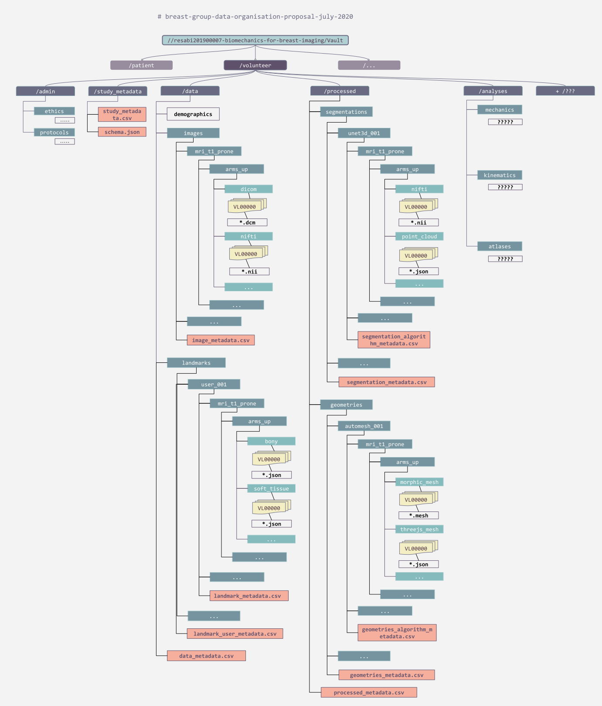

=================
Data organisation
=================

This section of the documentation outlines the directory structures for studies
conducted by our research group.

Style guide
===========

* Directories and files should adhere to lowercase dash-separated names
* Descriptions should include full sentences with a full stop at the end of the sentence.

Directory structure
===================
The directory structure for storing data for a given study is shown below. The
latest google drawings version of this figure can be found `here <https://docs.google.com/drawings/d/1uaPbD-R5PsFQFmaPRZk-TeNU9qBjBJgn0mZ8E6s92-A/edit>`_.

